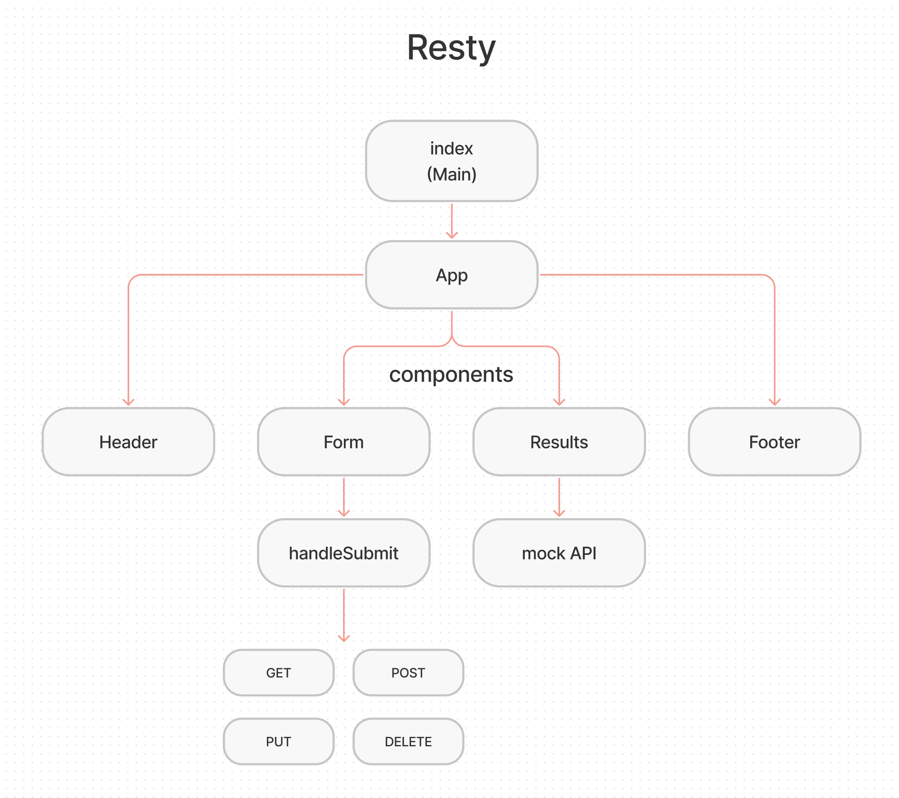

# Component Based UI

Author: Ryan Emmans

## Summary of Problem Domain

RESTY Application

- Our application will be an API testing tool that can be run in any browser, allowing a user to easily interact with APIs in a familiar interface.

### **Phase 1 Requirements**

- Setup basic scaffolding of the application, with intent being to add more functionality to the system as we go.
- This initial build sets up the file structure so that we can progressively build this application in a scalable manner.

### **Phase 2 Requirements**

Receive user input in preparation of connecting to live APIs, using the useState() hook in our functional components.

- As a user, I want to enter the REST Method and URL to an API.
- As a user, I want to see a summary of my request as well as results returned from an API request in my browser in a readable format.

Application Flow:

- User enters an API URL
- Chooses a REST Method
- Clicks the “Go” button
- Application fetches data from the URL given, with the method specified
- Displays the response headers and results separately
- Both headers and results should be “pretty printed” JSON

### **Phase 3 Requirements**

Connect RESTy to live APIs, fetching and displaying remote data. Our primary focus will be to service GET requests.

- As a user, I want to enter the URL to an API and issue a GET request so that I can retrieve it’s data.
- As a user, I want to see the results returned from an API request in my browser in a readable format.

## Links to application deployment

  
[GitHub Actions](https://github.com/ryanemmans/resty/actions)  
[Pull Requests](https://github.com/ryanemmans/resty/pulls?q=is%3Apr+is%3Aclosed)

## UML

## Requirements / Notes

- Simple, intuitive user interface
  - A form where a user:
    - Enters a REST API Endpoint (URI)
    - Selects the REST Method to use (get, post, put, delete)
    - For put and post, allow the user to enter JSON to be used as the body for the request
    - A button to initiate the request
  - An output section which:
    - Displays a spinner to indicate a request is in process
    - Once a request is complete:
      - Hide the spinner
      - Display a well formatted view of the API response in 2 sections
        - Headers
        - Body
  - A history section which:
    - Shows a list of all unique, successful requests
    - Allows a user to click or select one to re-populate the form so they can repeat the request
